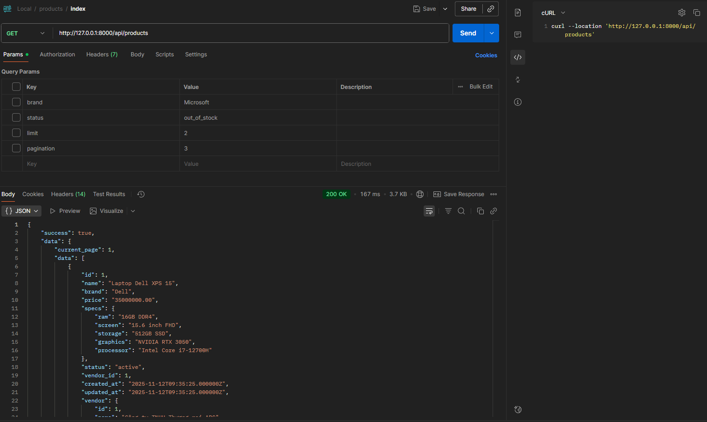
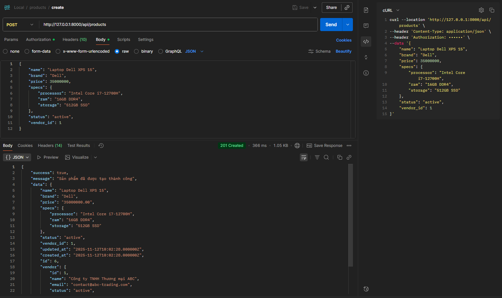
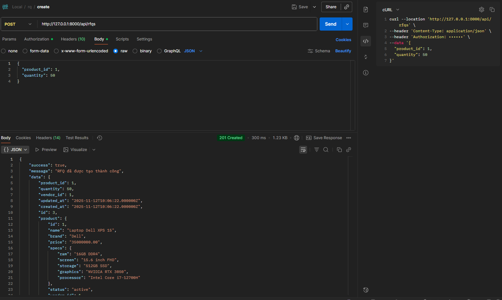
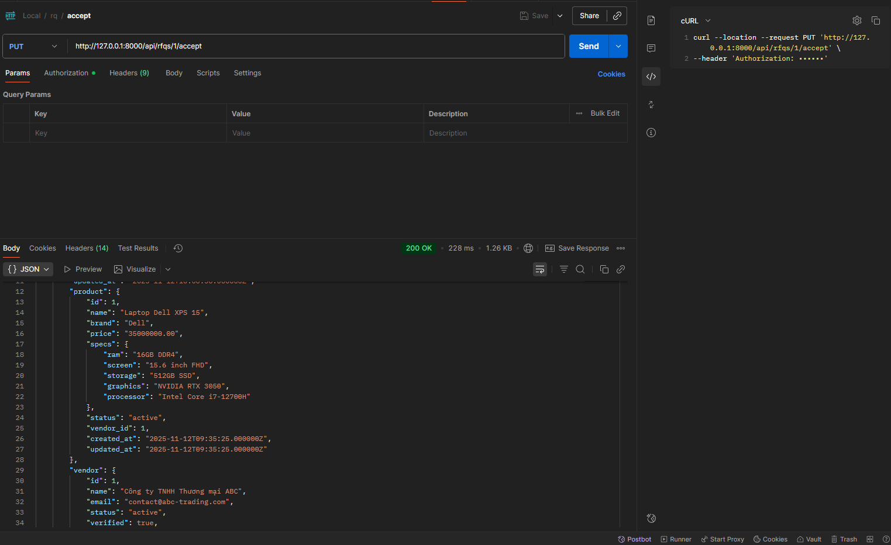

## B2B Marketplace - Hướng dẫn chạy local và kiến trúc

### Tổng quan

Schema được thiết kế cho hệ thống sàn B2B marketplace với 3 bảng chính: `vendors`, `products`, và `rfqs`.

### Cấu trúc Database

#### 1. Bảng `vendors` (Nhà bán)

**Các trường:**
- `id`: Primary key tự động tăng
- `name`: Tên nhà bán (VARCHAR 255)
- `email`: Email duy nhất (UNIQUE constraint)
- `status`: Trạng thái (active/inactive/suspended)
- `verified`: Đã xác thực hay chưa (BOOLEAN)
- `created_at`, `updated_at`: Timestamps tự động

**Indexes:**
- `idx_vendor_status`: Tối ưu truy vấn theo trạng thái
- `idx_vendor_verified`: Tối ưu lọc nhà bán đã xác thực
- `email`: Unique index tự động từ `->unique()` (hỗ trợ tìm kiếm và đảm bảo tính duy nhất)

**Lý do thiết kế:**
- Email UNIQUE đảm bảo mỗi nhà bán chỉ có một tài khoản
- Status ENUM giúp quản lý trạng thái nhà bán dễ dàng
- Verified flag cho phép phân biệt nhà bán đã được xác thực

#### 2. Bảng `products` (Sản phẩm)

**Các trường:**
- `id`: Primary key tự động tăng
- `name`: Tên sản phẩm
- `brand`: Thương hiệu
- `price`: Giá (DECIMAL 15,2 để hỗ trợ giá trị lớn)
- `specs`: Thông số kỹ thuật (JSON - linh hoạt cho nhiều loại sản phẩm)
- `status`: Trạng thái (active/inactive/out_of_stock)
- `vendor_id`: Foreign key đến bảng vendors (ON DELETE SET NULL)

**Indexes:**
- `idx_product_name`: Tối ưu tìm kiếm theo tên
- `idx_product_brand`: Tối ưu lọc theo thương hiệu
- `idx_product_status`: Tối ưu lọc theo trạng thái
- `idx_product_price`: Tối ưu sắp xếp/lọc theo giá
- `idx_product_search`: FULLTEXT index cho tìm kiếm full-text trên name và brand
- `vendor_id`: Index tự động từ `foreignId()` (hỗ trợ join và foreign key lookup)

**Foreign Keys:**
- `vendor_id` → `vendors(id)`: Mỗi sản phẩm thuộc về một nhà bán
  - `ON DELETE SET NULL`: Khi xóa nhà bán, sản phẩm vẫn tồn tại nhưng vendor_id = NULL
  - Foreign key tự động tạo index cho cột `vendor_id`

**Lý do thiết kế:**
- Specs dùng JSON để linh hoạt với nhiều loại sản phẩm khác nhau (không cần thêm bảng riêng)
- FULLTEXT index cho phép tìm kiếm nhanh theo tên và thương hiệu
- Index trên price hỗ trợ sắp xếp và lọc giá nhanh
- Foreign key đảm bảo tính toàn vẹn dữ liệu

#### 3. Bảng `rfqs` (Request for Quotation - Yêu cầu báo giá)

**Các trường:**
- `id`: Primary key tự động tăng
- `product_id`: Foreign key đến products (NOT NULL)
- `vendor_id`: Foreign key đến vendors (NOT NULL)
- `quantity`: Số lượng yêu cầu
- `status`: Trạng thái (pending/accepted/rejected)
- `created_at`, `updated_at`: Timestamps

**Indexes:**
- `idx_rfq_status`: Tối ưu lọc theo trạng thái RFQ
- `idx_rfq_created`: Tối ưu sắp xếp theo thời gian tạo
- `product_id`: Index tự động từ `foreignId()` (hỗ trợ join và foreign key lookup)
- `vendor_id`: Index tự động từ `foreignId()` (hỗ trợ join và foreign key lookup)

**Foreign Keys:**
- `product_id` → `products(id)`: RFQ liên quan đến sản phẩm cụ thể
  - `ON DELETE CASCADE`: Xóa sản phẩm thì xóa luôn RFQ liên quan
  - Foreign key tự động tạo index cho cột `product_id`
- `vendor_id` → `vendors(id)`: RFQ gửi đến nhà bán cụ thể
  - `ON DELETE CASCADE`: Xóa nhà bán thì xóa luôn RFQ liên quan
  - Foreign key tự động tạo index cho cột `vendor_id`

**Lý do thiết kế:**
- Foreign keys đảm bảo tính toàn vẹn: không thể tạo RFQ cho sản phẩm/nhà bán không tồn tại
- CASCADE delete phù hợp vì RFQ không có ý nghĩa khi sản phẩm/nhà bán đã bị xóa
- Index trên status giúp truy vấn RFQ đang pending nhanh
- Index trên created_at hỗ trợ sắp xếp theo thời gian

### Tối ưu hóa Performance

1. **Indexing Strategy:**
   - Index trên các cột thường dùng để filter (status, brand, verified)
   - Index trên các cột thường dùng để sort (price, created_at)
   - FULLTEXT index cho tìm kiếm sản phẩm
   - **Lưu ý:** 
     - `->unique()` tự động tạo unique index (không cần thêm index riêng)
     - `foreignId()` tự động tạo index cho foreign key (không cần thêm index riêng)
     - Tránh tạo index trùng lặp để tối ưu hiệu suất và tránh lỗi migration

2. **Foreign Key Constraints:**
   - Đảm bảo tính toàn vẹn dữ liệu
   - ON DELETE CASCADE/SET NULL phù hợp với business logic

3. **Data Types:**
   - DECIMAL cho price (chính xác, không mất mát)
   - JSON cho specs (linh hoạt, không cần schema cố định)
   - ENUM cho status (rõ ràng, hiệu quả)

### Mock Data

File `database/mock_data.json` chứa dữ liệu mẫu:
- 3 vendors (nhà bán)
- 5 products (sản phẩm)
- 2 RFQs (yêu cầu báo giá)

Có thể import dữ liệu này để test và phát triển ứng dụng.

### Cách sử dụng

#### Sử dụng Laravel Migrations

1. **Chạy migrations để tạo bảng:**
   ```bash
   php artisan migrate
   ```
   Lệnh này sẽ tạo 3 bảng theo thứ tự:
   - `vendors`
   - `products`
   - `rfqs`

2. **Seed mock data:**
   ```bash
   php artisan db:seed --class=B2BSeeder
   ```
   Hoặc chạy tất cả seeders:
   ```bash
   php artisan db:seed
   ```

### Chạy local

1) Cài đặt phụ thuộc
```bash
composer install
```

2) Tạo file môi trường (nếu chưa có)
```bash
cp .env.example .env
php artisan key:generate
```

3) Migrate database và seed dữ liệu mẫu
```bash
php artisan migrate:fresh --seed
```
Seeder chính dùng `database/mock_data.json` để nạp dữ liệu mẫu.

4) Chạy server
```bash
php artisan serve
```
API sẽ chạy tại `http://127.0.0.1:8000`.

5) Chạy test
```bash
php artisan test --testsuite=Feature
```

### Middleware & tối ưu server

- Rate limiting: áp dụng `throttle:100,1` cho group `api` (100 requests/phút).
- Error handling (app\Exceptions\Handler.php): bắt mọi exception chưa xử lý, log lỗi và trả JSON 500 thân thiện.
- Request logging middleware (app\Http\Middleware\RequestLoggingMiddleware.php): log method, path, status, thời gian xử lý theo mỗi request.

Các middleware này được cấu hình trong `app/Http/Kernel.php`.

### Authentication: Vì sao dùng JWT (mock)

- Yêu cầu demo nhanh, không phụ thuộc hệ thống auth bên ngoài.
- Đơn giản: middleware `JWTAuth` chỉ chấp nhận token cố định `admin-token` qua Bearer token.
- Dễ test: test gửi header `Authorization: Bearer admin-token` là đủ.

Khi đưa vào production, có thể thay thế bằng JWT thực (Keycloak/Auth0) hoặc Laravel Sanctum.

### Mock DB bằng JSON

- File `database/mock_data.json` chứa `vendors`, `products`, `rfqs`.
- Seeder `DatabaseSeeder` gọi `B2BSeeder` để import file JSON.
- Trong unit test, `tests/Feature/ApiEndpointsTest.php` nạp JSON trực tiếp:
  - Đọc file JSON
  - Bulk insert 1 lần cho mỗi bảng (`vendors`, `products`, `rfqs`) để nhanh và ổn định

Điều này giúp test độc lập dữ liệu, dễ kiểm soát, và tái lập kết quả.

### Caching strategy

- Endpoint `GET /api/products` cache 5 phút kết quả theo query string.
- Key cache: hash từ tham số query (`products:{md5(query)}`).

Lợi ích:
- Giảm truy vấn lặp lại với cùng filter.
- Nhanh hơn đáng kể với danh sách sản phẩm phổ biến.

Cache driver có thể cấu hình qua `.env` (`CACHE_DRIVER=array|file|redis|memcached`).

---
# API Documentation

## Authentication
Một số endpoints yêu cầu JWT authentication. Sử dụng Bearer token trong header:

```
Authorization: Bearer admin-token
```

**Lưu ý:** Hiện tại chỉ chấp nhận mock token `admin-token` để test.

---

## Products API

### 1. GET /api/products
Lấy danh sách sản phẩm với pagination và filtering.

**Query Parameters:**
- `brand` (optional): Lọc theo thương hiệu (ví dụ: `?brand=Dell`)
- `status` (optional): Lọc theo trạng thái (`active`, `inactive`, `out_of_stock`)
- `limit` (optional): Số lượng items mỗi trang (mặc định: 10)
- `page` (optional): Trang hiện tại (mặc định: 1)

**Example Request:**
```bash
GET /api/products?brand=Dell&status=active&limit=10
```

**Example Response:**
```json
{
    "success": true,
    "data": {
        "current_page": 1,
        "data": [
            {
                "id": 1,
                "name": "Laptop Dell XPS 15",
                "brand": "Dell",
                "price": "35000000.00",
                "specs": {
                    "ram": "16GB DDR4",
                    "screen": "15.6 inch FHD",
                    "storage": "512GB SSD",
                    "graphics": "NVIDIA RTX 3050",
                    "processor": "Intel Core i7-12700H"
                },
                "status": "active",
                "vendor_id": 1,
                "created_at": "2025-11-12T10:20:32.000000Z",
                "updated_at": "2025-11-12T10:20:32.000000Z",
                "vendor": {
                    "id": 1,
                    "name": "Công ty TNHH Thương mại ABC",
                    "email": "contact@abc-trading.com",
                    "status": "active",
                    "verified": true,
                    "created_at": "2025-11-12T10:20:32.000000Z",
                    "updated_at": "2025-11-12T10:20:32.000000Z"
                }
            },
            {
                "id": 2,
                "name": "Máy in Canon PIXMA G3010",
                "brand": "Canon",
                "price": "4500000.00",
                "specs": {
                    "type": "Inkjet",
                    "color": "Color",
                    "ink_system": "Continuous Ink Supply",
                    "paper_size": "A4",
                    "connectivity": "USB, WiFi"
                },
                "status": "active",
                "vendor_id": 1,
                "created_at": "2025-11-12T10:20:32.000000Z",
                "updated_at": "2025-11-12T10:20:32.000000Z",
                "vendor": {
                    "id": 1,
                    "name": "Công ty TNHH Thương mại ABC",
                    "email": "contact@abc-trading.com",
                    "status": "active",
                    "verified": true,
                    "created_at": "2025-11-12T10:20:32.000000Z",
                    "updated_at": "2025-11-12T10:20:32.000000Z"
                }
            }
        ],
        "first_page_url": "http://127.0.0.1:8000/api/products?page=1",
        "from": 1,
        "last_page": 3,
        "last_page_url": "http://127.0.0.1:8000/api/products?page=3",
        "links": [
            {
                "url": null,
                "label": "&laquo; Previous",
                "active": false
            },
            {
                "url": "http://127.0.0.1:8000/api/products?page=1",
                "label": "1",
                "active": true
            },
            {
                "url": "http://127.0.0.1:8000/api/products?page=2",
                "label": "2",
                "active": false
            },
            {
                "url": "http://127.0.0.1:8000/api/products?page=3",
                "label": "3",
                "active": false
            },
            {
                "url": "http://127.0.0.1:8000/api/products?page=2",
                "label": "Next &raquo;",
                "active": false
            }
        ],
        "next_page_url": "http://127.0.0.1:8000/api/products?page=2",
        "path": "http://127.0.0.1:8000/api/products",
        "per_page": 2,
        "prev_page_url": null,
        "to": 2,
        "total": 5
    }
}
```

---

### 2. POST /api/products
Tạo sản phẩm mới.

**Request Body:**
```json
{
  "name": "Laptop Dell XPS 15",
  "brand": "Dell",
  "price": 35000000,
  "specs": {
    "processor": "Intel Core i7-12700H",
    "ram": "16GB DDR4",
    "storage": "512GB SSD"
  },
  "status": "active",
  "vendor_id": 1
}
```

**Validation Rules:**
- `name`: required, string, max 255
- `brand`: required, string, max 100
- `price`: required, numeric, min 0.01
- `specs`: optional, array
- `status`: optional, enum (active/inactive/out_of_stock)
- `vendor_id`: optional, must exist in vendors table

**Example Response (Success - 201):**
```json
{
  "success": true,
  "message": "Sản phẩm đã được tạo thành công",
  "data": {
    "id": 6,
    "name": "Laptop Dell XPS 15",
    "brand": "Dell",
    "price": "35000000.00",
    "specs": {...},
    "status": "active",
    "vendor_id": 1
  }
}
```

**Example Response (Error - 400):**
```json
{
    "success": false,
    "message": "Validation Error",
    "errors": {
        "name": [
            "Tên sản phẩm là bắt buộc"
        ],
        "price": [
            "Giá phải lớn hơn 0"
        ]
    }
}
```

---

## RFQs API

### 1. GET /api/rfqs
Lấy danh sách RFQ với filtering.

**Query Parameters:**
- `vendor_id` (optional): Lọc theo nhà bán (ví dụ: `?vendor_id=1`)
- `status` (optional): Lọc theo trạng thái (`pending`, `accepted`, `rejected`)

**Example Request:**
```bash
GET /api/rfqs?vendor_id=1&status=pending
```

**Example Response:**
```json
{
  "success": true,
  "data": [
    {
      "id": 1,
      "product_id": 1,
      "vendor_id": 1,
      "quantity": 50,
      "status": "pending",
      "created_at": "2024-01-15T10:30:00.000000Z",
      "product": {
        "id": 1,
        "name": "Laptop Dell XPS 15",
        "brand": "Dell"
      },
      "vendor": {
        "id": 1,
        "name": "Công ty TNHH Thương mại ABC"
      }
    }
  ]
}
```

---

### 2. POST /api/rfqs
Tạo RFQ mới. **Yêu cầu JWT authentication.**

**Headers:**
```
Authorization: Bearer admin-token
```

**Request Body:**
```json
{
  "product_id": 1,
  "quantity": 50
}
```

**Validation Rules:**
- `product_id`: required, must exist in products table
- `quantity`: required, integer, min 1

**Note:** `vendor_id` sẽ tự động được lấy từ sản phẩm.

**Example Response (Success - 201):**
```json
{
  "success": true,
  "message": "RFQ đã được tạo thành công",
  "data": {
    "id": 3,
    "product_id": 1,
    "vendor_id": 1,
    "quantity": 50,
    "status": "pending",
    "product": {...},
    "vendor": {...}
  }
}
```

**Example Response (Error - 401):**
```json
{
  "success": false,
  "message": "Token không được cung cấp",
  "error": "Unauthorized"
}
```

---

### 3. PUT /api/rfqs/{id}/accept
Chấp nhận một RFQ. **Yêu cầu JWT authentication.**

**Headers:**
```
Authorization: Bearer admin-token
```

**Example Request:**
```bash
PUT /api/rfqs/1/accept
```

**Example Response (Success - 200):**
```json
{
  "success": true,
  "message": "RFQ đã được chấp nhận thành công",
  "data": {
    "id": 1,
    "product_id": 1,
    "vendor_id": 1,
    "quantity": 50,
    "status": "accepted",
    "product": {...},
    "vendor": {...}
  }
}
```

**Example Response (Error - 400):**
```json
{
  "success": false,
  "message": "RFQ này đã được xử lý",
  "error": "Bad Request"
}
```

**Example Response (Error - 404):**
```json
{
  "success": false,
  "message": "RFQ không tồn tại",
  "error": "Not Found"
}
```

---

## Error Responses

Tất cả các lỗi đều trả về format JSON thống nhất:

### 400 Bad Request
```json
{
  "success": false,
  "message": "Thông báo lỗi cụ thể",
  "error": "Bad Request"
}
```

### 401 Unauthorized
```json
{
  "success": false,
  "message": "Token không hợp lệ",
  "error": "Unauthorized"
}
```

### 404 Not Found
```json
{
  "success": false,
  "message": "Resource không tồn tại",
  "error": "Not Found"
}
```

---

## Testing với cURL

### Lấy danh sách sản phẩm
```bash
curl --location 'http://127.0.0.1:8000/api/products'
```


### Tạo sản phẩm mới
```bash
curl -X POST "http://localhost:8000/api/products" \
  -H "Content-Type: application/json" \
  -d '{
    "name": "Laptop Test",
    "brand": "Dell",
    "price": 20000000,
    "specs": {"ram": "8GB"},
    "status": "active",
    "vendor_id": 1
  }'
```


### Tạo RFQ (cần authentication)
```bash
curl -X POST "http://localhost:8000/api/rfqs" \
  -H "Content-Type: application/json" \
  -H "Authorization: Bearer admin-token" \
  -d '{
    "product_id": 1,
    "quantity": 50
  }'
```


### Chấp nhận RFQ (cần authentication)
```bash
curl -X PUT "http://localhost:8000/api/rfqs/1/accept" \
  -H "Authorization: Bearer admin-token"
```

